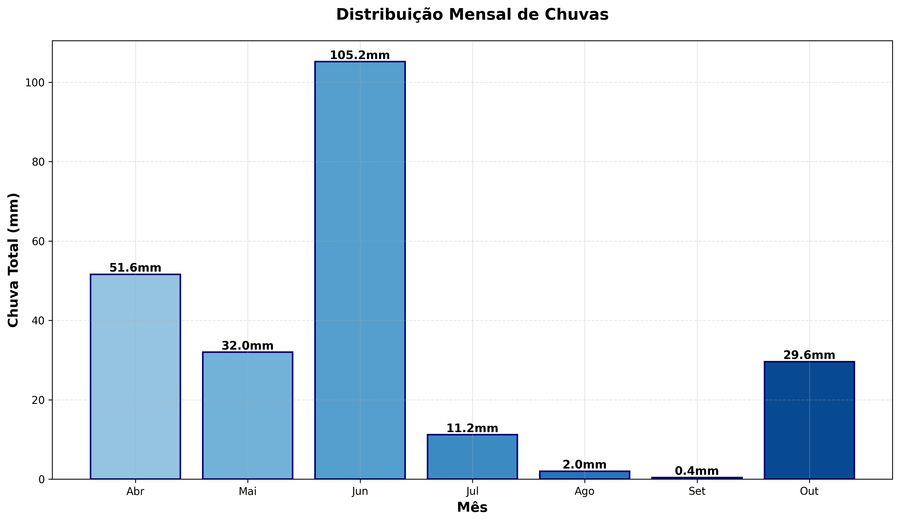
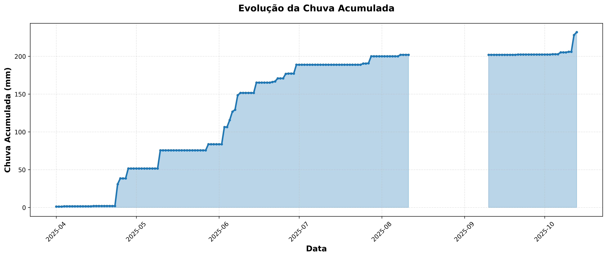
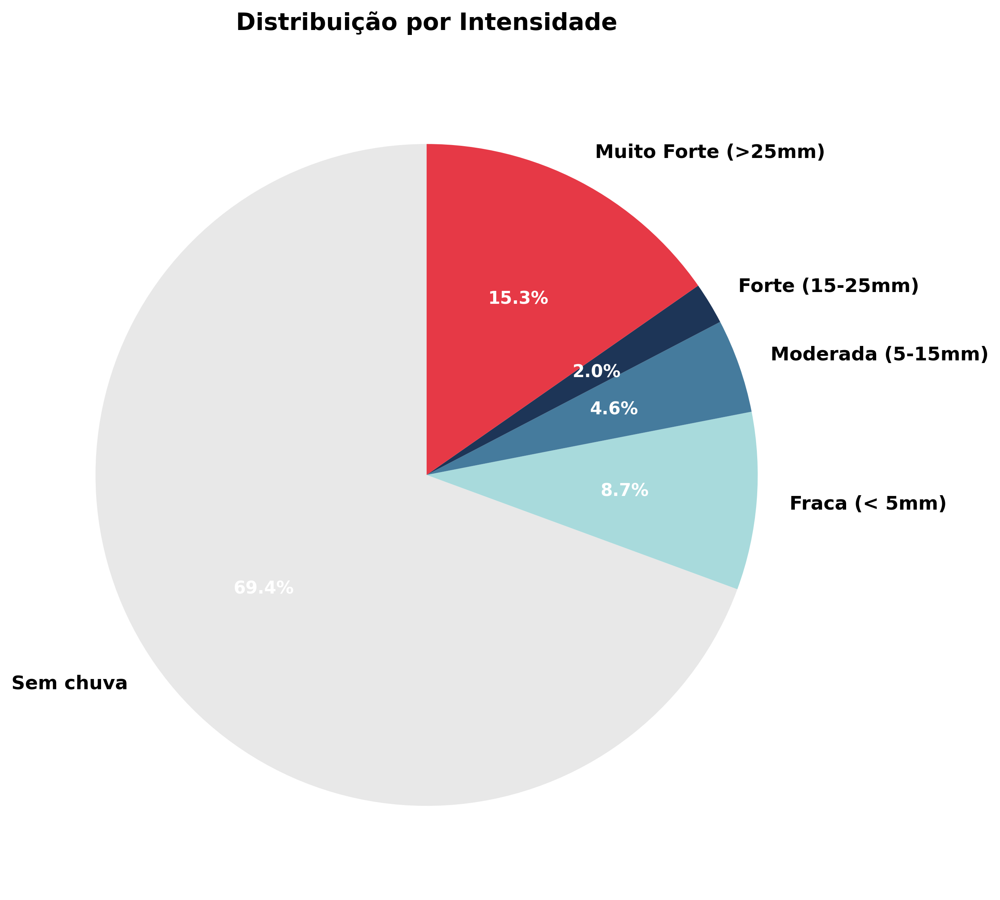
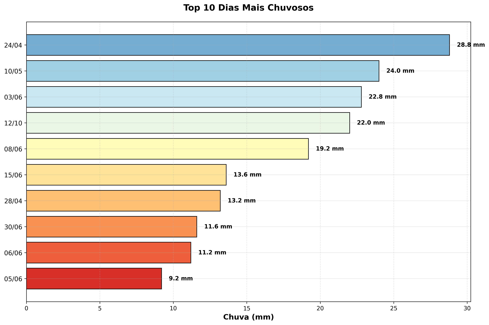
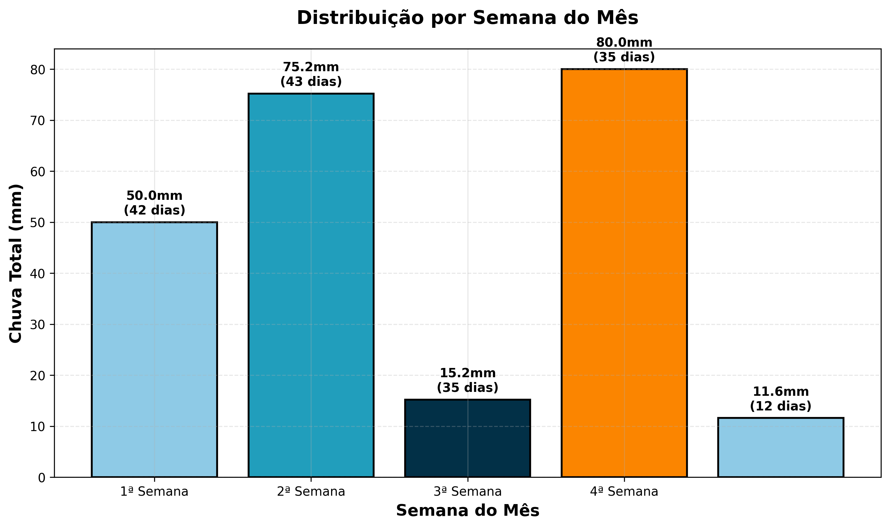
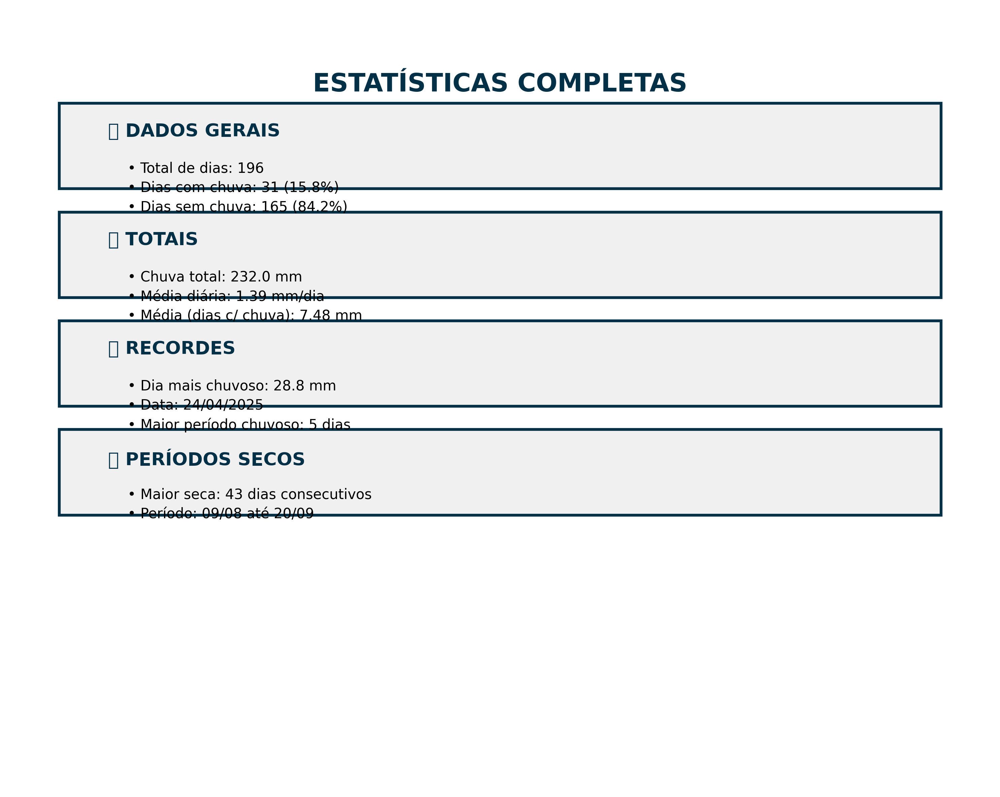
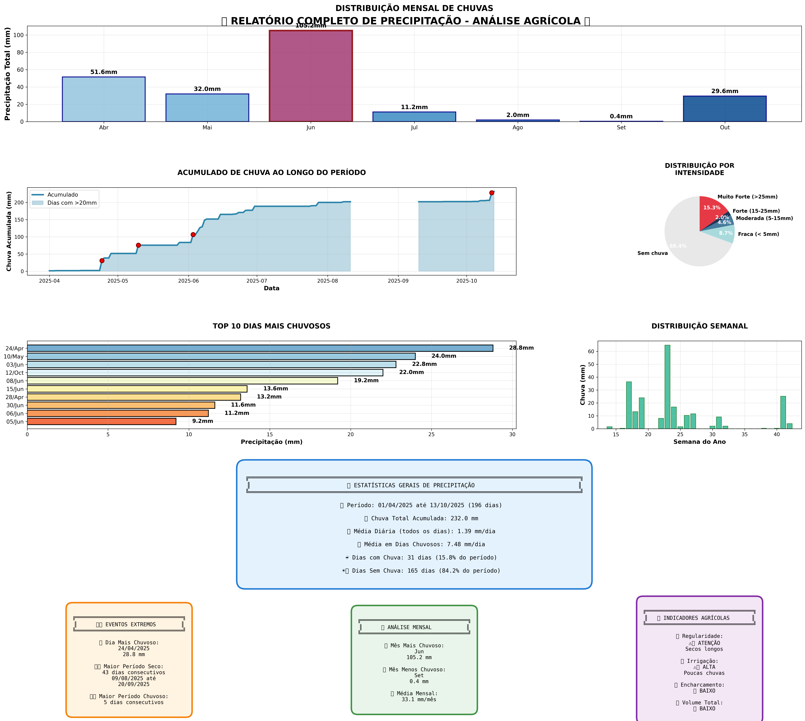
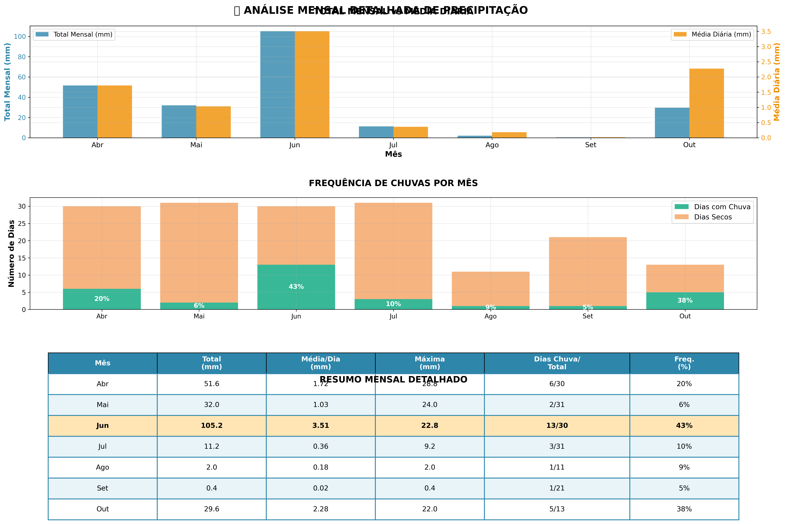

# 🌧️ Relatório de Análise de Chuvas

**Estação Meteorológica Galinhada**  
*Período: Abril a Outubro de 2025*

---

## 📊 Resumo Executivo

- **Total de dias analisados:** 196 dias
- **Período completo:** 01/04/2025 a 13/10/2025
- **Chuva total acumulada:** 232,0 mm
- **Dias com chuva:** 31 dias (15,8%)
- **Dias sem chuva:** 165 dias (84,2%)

---

## 📈 Distribuição Mensal de Chuvas

Análise da precipitação acumulada mês a mês, permitindo identificar períodos mais chuvosos e secos.



## 📉 Evolução da Chuva Acumulada

Linha do tempo mostrando o acúmulo progressivo de precipitação ao longo do período analisado.



<div style="page-break-after: always;"></div>

---

## 🥧 Distribuição por Intensidade

Classificação dos dias segundo a intensidade da precipitação: fraca, moderada, forte ou muito forte.



## 🏆 Top 10 Dias Mais Chuvosos

Ranking dos dias com maior volume de precipitação registrado, destacando eventos extremos.



<div style="page-break-after: always;"></div>

---

## 📅 Distribuição por Semana do Mês

Análise da distribuição da chuva ao longo das semanas de cada mês, útil para planejamento agrícola.



## 📋 Estatísticas Completas

Painel resumido com todos os indicadores principais e recordes do período analisado.



<div style="page-break-after: always;"></div>

---

## 📊 Relatório Completo Integrado

Visão consolidada com todos os gráficos principais em um único painel para análise rápida.



<div style="page-break-after: always;"></div>

---

## 📅 Análise Mensal Detalhada

Tabela comparativa completa mês a mês com totais, médias e estatísticas detalhadas.



<div style="page-break-after: always;"></div>

---

## 🌾 Considerações Agronômicas

### Períodos Críticos Identificados

**Maior período de seca:** Identifique os períodos mais longos sem chuva para planejamento de irrigação.

**Eventos intensos:** Dias com precipitação acima de 25mm requerem atenção especial para drenagem e manejo do solo.

### Recomendações

1. **Irrigação:** Ajustar cronograma baseado nos períodos secos identificados
2. **Planejamento:** Considerar a distribuição mensal para escolha de culturas
3. **Drenagem:** Preparar sistema para eventos de alta intensidade
4. **Monitoramento:** Continuar acompanhamento para análise de tendências

---

## 📄 Dados Brutos

Os dados completos estão disponíveis em formato CSV:
- **Arquivo:** `output/chuvas_diarias_20251013_201148.csv`
- **Formato:** 3 colunas (data, chuva(mm), intensidade_de_chuva(mm/h))
- **Separador:** ponto e vírgula (;)
- **Decimal:** vírgula (,)

### Estrutura do CSV

```
data;chuva(mm);intensidade_de_chuva(mm/h)
01/04/2025;1,2;2,4
02/04/2025;0,0;0,0
...
```

---

## 🔄 Atualização dos Dados

Para gerar novos relatórios com dados atualizados:

```bash
python processar_chuvas.py
```

Este comando irá:
1. Processar todos os arquivos CSV da pasta `Dados/`
2. Gerar novo CSV consolidado
3. Criar todos os gráficos atualizados
4. Atualizar este relatório automaticamente

---

## 📞 Informações

**Estação:** Weathercloud Galinhada  
**Localização:** Propriedade Rural Galinhada  
**Sistema:** Estação Meteorológica Automática  
**Frequência de leitura:** 10 em 10 minutos  
**Processamento:** Agregação diária

---

*Relatório gerado automaticamente pelo Sistema de Análise de Chuvas*  
*Última atualização: 13 de outubro de 2025*
